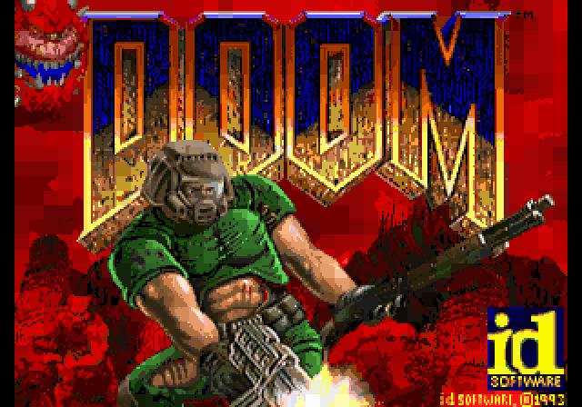
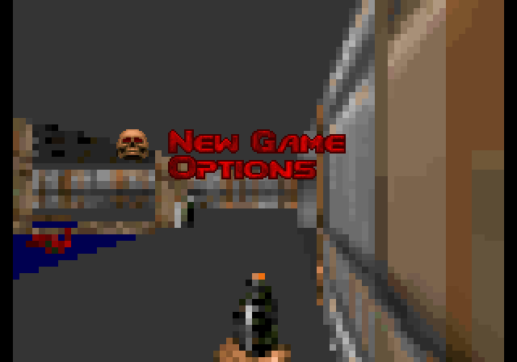
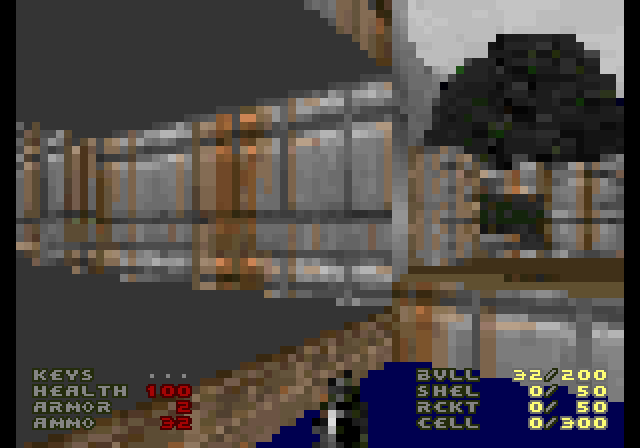

# Doom64KB



Doom was originally designed in 1993 for 32-bit DOS computers with 4 MB of
RAM. It is mostly written in C, with very little assembly. Most later ports
target 32-bit or newer systems with a flat memory model.

Doom64KB is a port for computers with only 64 KB of RAM and plenty of ROM
space. It is based on [Doom8088](https://github.com/FrenkelS/Doom8088), a port
of Doom for 16-bit DOS computers.

Official Doom64KB releases are available
[here](https://github.com/FrenkelS/Doom64KB/releases).

## Neo Geo Sprite Renderer

The Neo Geo version renders Doom through a full-color sprite
microframebuffer. The game view is no longer limited to the FIX layer's 8x8
character cells: the High detail mode renders an 80x56 logical framebuffer
and expands each logical pixel to a 4x4 block across the 320x224 display.

| FIX menu over sprite gameplay | Full-color 80x56 sprite gameplay |
|---|---|
|  |  |

### Features

- Full-color sprite game view using the original 256-entry Doom palette.
- Runtime **Graphics Detail** option with High, Medium, and Low modes.
- Two complete sprite control-buffer sets, swapped at VBlank to avoid exposing
  partially updated tile and palette attributes.
- FIX-layer menus, HUD, text, and automap information over the sprite view.
- Menu overlays can remain visible while the title demo or game continues
  underneath.
- Exact sprite-backed TITLEPIC and WIMAP0 backgrounds generated from the
  compact Neo Geo FIX artwork and its original 16 palettes.
- Full-color Doom melt transition using the FIX layer, including transitions
  to and from sprite-backed static backgrounds.
- YM2610 digital sound effects and music generated from the supplied WAD, with
  separate SFX and Music volume controls.
- Rotating overlaid automap.

### Graphics Detail

The detail option changes the Doom renderer's logical viewport as well as the
Neo Geo hardware shrink value. Lower modes therefore reduce the number of
columns, spans, and sprite cells that must be rendered.

| Detail | Logical framebuffer | Sprite cell | Displayed area |
|---|---:|---:|---:|
| High | 80x56 | 4x4 | 320x224 |
| Medium | 53x37 | 6x6 | 318x222, centered |
| Low | 40x28 | 8x8 | 320x224 |

Neo Geo sprites are built from 16x16 C-ROM tiles. The microframebuffer stores
solid-color 16x16 tiles and uses the hardware shrinker to display each tile at
4x4, 6x6, or 8x8. Sprite pen 0 is transparent, so the 256 Doom colors are
packed into 18 sprite palettes with 15 visible colors per palette. Each
logical framebuffer cell selects both a solid tile and its palette through
SCB1.

High detail uses 160 vertical sprite strips per framebuffer set: 80 logical
columns split into two vertical chunks. Only 80 sprites are active on any
scanline. Two complete sets are reserved; the hidden set receives the next
frame's tile and palette attributes, then becomes visible at VBlank while the
old set is hidden.

The title and intermission backgrounds use a separate set of 38 sprite strips.
Each original 8x8 FIX tile is duplicated into a 16x16 sprite tile and shrunk
back to 8x8, preserving the compact source image exactly. Menus and status
text stay on FIX so they can render cleanly above either a static sprite
background or live gameplay.

## Current Limitations

- Only Doom 1 E1M1 and E1M8 currently have complete enemies and powerups.
  E1M6 is replaced by E1M1, and the other maps do not yet contain all things.
- Floors and ceilings are flat colored rather than texture mapped.
- No light diminishing.
- No saving or loading.
- No multiplayer.
- High detail improves clarity but costs more CPU time than the original
  38x28 FIX framebuffer.

## Controls

| Action | Neo Geo |
|---|---|
| Walk | Joystick |
| Fire | B |
| Use / Sprint | A |
| Strafe | C & D |
| Weapon up | A + D |
| Weapon down | A + C |
| Menu | Start Player 1 |
| Automap | Start Player 2 |
| Automap zoom in and out | C & D |
| Automap follow mode | A |

## Cheats

| Effect | Code |
|---|---|
| Chainsaw | C, Up, Up, Left, C, A, A, Up |
| God mode | Up, Up, Down, Down, Left, Right, Left, Right |
| Weapons & Keys | Down, Down, Left, Right, Left, Right, B, A |
| Weapons | D, D, A, D, A, Up, Up, Left |
| No Clipping | Up, Down, Left, Right, Up, Down, Left, Right |
| Invisibility | A, A, A, B, A, A, C, B |
| Radiation shielding suit | B, B, D, Up, A, A, D, B |
| Auto-map | C, A, D, B, A, D, C, Up |
| Lite-Amp Goggles | Down, Left, D, Left, D, C, C, A |
| Toggle FPS counter | A, B, C, Up, Down, B, Left, Left |

## Building

The Neo Geo build requires
[ngdevkit](https://github.com/dciabrin/ngdevkit), Python 3, and a generated
`DOOM64TB.WAD` in the repository root.

```sh
# Build the ROM.
bash bneogeo.sh

# Build and launch it with ngdevkit-gngeo.
bash bneogeo.sh -run

# Build the timedemo benchmark version.
bash bneogeo.sh -timedemo
```

The build script generates the sprite C-ROM, Z80 sound driver, and YM2610
V-ROM, combines them with the generated FIX menu assets, and creates the ROM
set under `neogeo/rom`.
`CROM_FILE_BYTES` and `AUDIO_VROM_BYTES` can override the generated C-ROM and
V-ROM sizes when testing a different cartridge layout.

| Platform | Platform-specific code | Compiler | Build script |
|---|---|---|---|
| Neo Geo | `i_neogeo.c`, `i_neogev.c`, `i_audio.c` | ngdevkit | `bneogeo.sh` |
